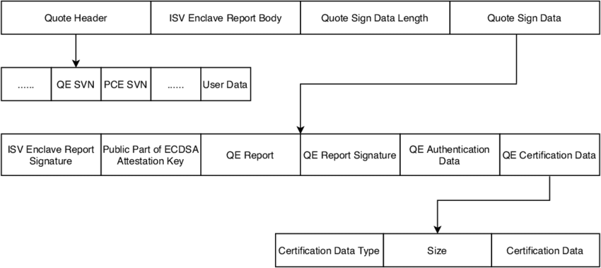
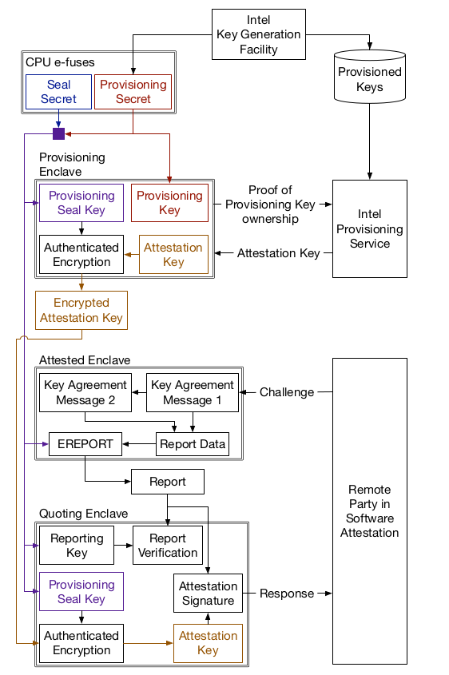
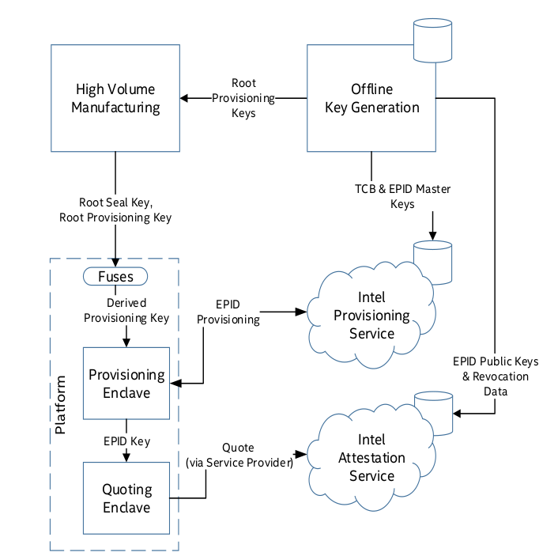

# Details of IAS

### Quote structure

```c++
typedef struct _quote_t
{
    uint16_t            version;        /* 0   */
    uint16_t            sign_type;      /* 2   */
    sgx_epid_group_id_t epid_group_id;  /* 4   */
    sgx_isv_svn_t       qe_svn;         /* 8   */
    sgx_isv_svn_t       pce_svn;        /* 10  */
    uint32_t            xeid;           /* 12  */
    sgx_basename_t      basename;       /* 16  */
    sgx_report_body_t   report_body;    /* ISV enclave report body*/
    uint32_t            signature_len;  /* 432 */
    uint8_t             signature[];    /* 436 */
} sgx_quote_t;
```

Quote assigned by `Attestation Key`, `Atestation Key` is generated by *Intel Provisioning Service*

`signature[]` is a list, which include

- ISV Enclave Report Signature
- Public Part of ECDSA Attestation Key (If using ECDSA algorithm)
- Quote Enclave Report
- QE Report Signature
- QE Authentication Data
- QE Certification Data
  - Certification Data Type
  - Size
  - Certification Data




 



 ### IAS verification

1. checks `spid` is the same as user requesting verification (linkable signatures)

2. checks `epid_group_id` is an up to date group

3. verifies EPID signature:

   1. verifies signature is signed by a group member

   2. checks signature is not signed by a revoked private key (by checking Private Key Revocation List)

   3.  checking Signature Revocation List

      > Verifies non-revoked portion of signature
      > used up to date sigRL & checks each member
      > of the sigRL has a correct entry.