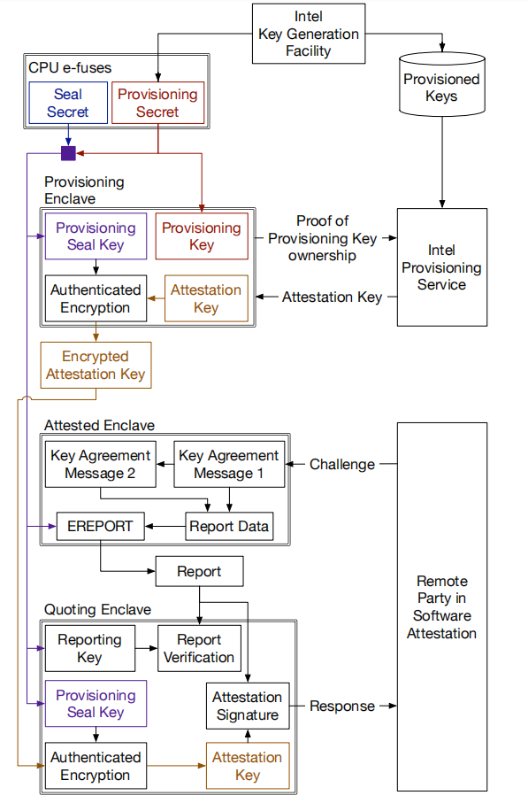
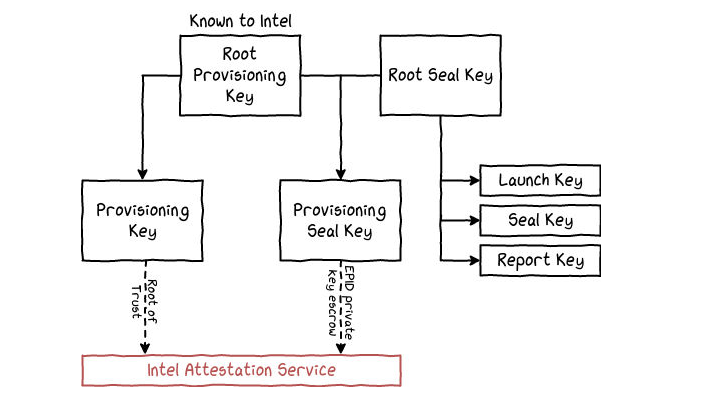
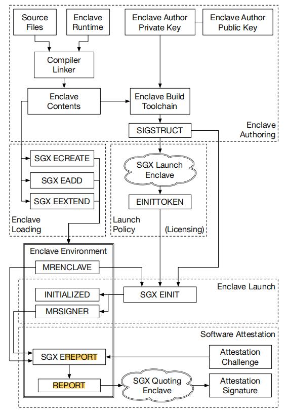
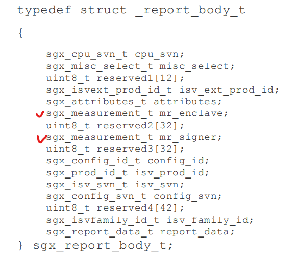

# Note for Remote Attestation

## Ref

[AE介绍](https://blog.csdn.net/clh14281055/article/details/107919383)

[SGX外部组件概述](https://www.4hou.com/posts/JNBJ)

[SGX内部组件概述](http://www.myzaker.com/article/5b6ce8b777ac6449035e2042)

[SGX内部组件概述（实现分析）](https://www.163.com/dy/article/FQRC1IRD0511CJ6O.html)

 [SGX Enclave Measurement](../2016-086.pdf)#**5.6 SGX Enclave Measurement**

## Architectural Enclave

[AE介绍](https://blog.csdn.net/clh14281055/article/details/107919383)

Architectural Enclave（AE）包括了LauchEnclave、QuotingEnclave、ProvisioningEnclave

所有的AE都是特殊的Enclave，预先由Intel进行编译、签名。他们会在PSW安装的时候启动起来，叫做aesmd，ae守护进程 (architectural enclave service manager deamon)

>  支持Intel SGX程序执行，需要 
>
> - untrusted部分的守护进程aesmd, 提供application enclave service manager. 
> - Architectural Enclave:  	
>   - Launch Enclave(le) 	
>   - Quoting Enclave(qe) 	
>   - Platform Service Enclave(pse) 	
>   - Provisioning Enclave (pve) 	
>   - Provisioning Certification Enclave(pce) 	
>   - Reference Launch Enclave 	
> - 和一些配套的untrusted AE接口

### Launch Enclave

启动Enclave（Launch Enclave ,LE）是负责向希望在平台上执行任务的其他enclave分配EINITTOKEN结构，该结构会检查enclave的签名和标识，看它们是否有效。为了生成令牌，EINITTOKEN结构会负责启动密钥，因此启动Enclave是唯一能够检索EINITTOKEN结构的enclave。

### Provisioning Enclave

Provisioning Enclave（PvE）是负责通过与Intel Provisioning Service服务器通信来**检索认证密钥**的enclave。为了做到这一点，它使用PcE提供的证书认证平台的真实性。

> PvE和远端Intel配置服务器协商出一个EPID私钥（现在额外支持DCAP），这个私钥由RPK（Root Provisioning Key）推导出，作为SGX平台配置密钥（Provisioning Key）。
>
> 具体来说，配置密钥的形成来，之后有了SGX平台配置密钥，PvE还通过Root Provisioning Key（RPK，由Intel Key Generation Facility中的硬件安全模块随机生成，存于e-fuses中）和Root Seal Key（RSK，也存于e-fuses中）产生“配置密封密钥”，用于加密SGX平台配置密钥，并可以将加密结果存放到不可信存储中。

### Provisioning Certificate Enclave

Provisioning Certificate Enclave（PcE）是负责签名发送给PvE的处理器证书的enclave。为了做到这一点，PcE使用Provisioning Key，它是唯一能够检索到它的enclave。 PvE和PcE目前还是作为独立的enclave来实现的。

### Quoting Enclave

QuotingEnclave (QE）用于远程认证中，对本地Enclave报告签名发送，以及对远程Enclave报告进行验证（来自对端QE的可信签名）并转发给本地Enclave。

Enclave本地报告也叫做REPORT，只能在当前Enclave中有可信价值，只能用于同一SGX平台下的认证，**远程认证的可信报告QUOTE可信程度来自QE的背书**。QE也是Intel签名过的Enclave。**QE可以验证本地报告**(因为本地报告的签名来源于RSK导出的报告密钥Report Key)并用私钥签名产生Quote，远端就能用QE公钥验证，从而实现远程认证。

对于远端Enclave的验证，QE会负责检测远端Enclave的可信程度以及它在远程认证过程中执行的环境。它会解密由PvE加密（利用*配置密封密钥 Provision Seal Key*）存储在CPU中的（从Intel配置服务器处接收的）SGX平台配置密钥，并使用该密钥将REPORT结构（用于本地Enclave的验证）**转换**为QUOTE结构（用于远程验证）。

如上图中，远程验证者发出挑战，验证该Enclave可信程度。Enclave使用EREPORT指令将挑战与自身绑定。然后不可信APP将本地认证EREPORT交给QE，QE推导Report Key来验证报告完整性。然后用Provisioning Seal Key来解密不可信系统软件返回的SGX平台长期配置密钥。QE用SGX平台长期认证密钥(本质是EPID私钥)签名本地认证报告，形成一个Quote。验证者收到认证响应Quote，将其交给Intel Quote服务，使用EPID组公钥（配置密钥使EPID私钥）来验证Quote。

> The report is delivered to the Quoting Enclave for signing.
>
> 1. The Quoting Enclave authenticates the report.
>
> 2. The Quoting Enclave converts the body of the report into a quote and signs it 
>
>    with the Intel EPID key.

### Platform Service Enclave

Platform Service Enclaves (PSE)是一个架构型enclave，为其他enclave提供多种服务，如单调计数器，可信时间等。这些enclave利用管理引擎（ME），形成一个个孤立的，安全的管理平台。

### Key

## Measurement

>  [SGX Enclave Measurement](../2016-086.pdf)#**5.6 SGX Enclave Measurement**

### Report & Quote

#### report

An enclave report contains the following data, signed by **Report Key** (from RSK):

- **Measurement** of the code and data in the enclave.

- **A hash of the public key** in the ISV certificate presented at enclave initialization time.

- **User data.**

- Other security related state information (not described here).

- A signature block over the above data, which can be verified by the same platform that 

  produced the report.

#### quote

A quote includes the following data, signed by **EPID 私钥** (from RPK, by PvE):

- **Measurement** of the code and data in the enclave.

- **A hash of the public key** in the ISV certificate presented at enclave initialization time.

- **The Product ID and the Security Version Number** (SVN) of the enclave

-  **Attributes of the enclave**, for example, whether the enclave is running in debug mode.

- **User data included by the enclave in the data portion of the report structure**. Allows establishing a secure channel bound to the remote attestation process so a remote server may provision secrets to the entity that has been attested.

- **A signature block over the above data**, which is signed by the Intel EPID group key.

### EREPORT instruct

[SGX Developer Reference](Intel_SGX_Developer_Reference_Linux_2.13_Open_Source.pdf)#**report body**

### SGX create & measure

> [SGX内部组件概述](http://www.myzaker.com/article/5b6ce8b777ac6449035e2042)
>
> **The SGX Enclave Control Structure (SECS)**
>
> - SGX stores per-enclave metadata in a *SGX Enclave Control Structure* (SECS) associated with each enclave (§5.1.3).
>
> **ECREATE**
>
> - An enclave is born when the system software issues the ECREATE instruction, which turns a free EPC page into the SECS for the new enclave.

#### Enclave 检查（Enclave Measure）：

每个 enclave 都由其属性以及页面的位置、内容和保护的哈希值表示。具有相同哈希的两个 enclave 是相同的，该方法被称为 **MRENCLAVE**，用于检查 enclave 的完整性。

#### 签名检查（Signer Measure）：

每个 enclave 也由其管理者进行签名， **MRSIGNER** 包含管理者公钥的哈希值，**MRENCLAVE** 和 **MRSIGNER** 使用 SHA-256 哈希函数生成。

#### EINIT 令牌结构（EINITTOKEN）：

EINIT 指令使用 **EINITTOKEN** 结构来检查是否允许执行 enclave。它包含 enclave 的属性，哈希和签名者身份，它使用启动密钥执行的 HMAC 进行身份验证。

#### enclave 签名结构（SIGSTRUCT）：

每个 enclave 都与一个 **SIGSTRUCT** 结构相关联，该结构由管理者签名并包含 enclave 方法，签名者公钥，版本号（ISV，反映安全级别）和产品标识符（**ISVPRODID**，以区分同一管理者的 enclave） 。它负责确保 enclave 未被修改，然后使用其他密钥重新签名。

### 3.3

- Therefore, an attestation signature can be used to convince a verifier that the attestation data was produced by a specific piece of software, which is hosted inside a container that is isolated by trusted hardware from outside interference.

### 5.8

- An SGX-enabled processor computes a measurement of the code and data that is loaded in each enclave.

- The software inside an enclave can start a process that results in an SGX attestation signature, which includes the **enclave’s measurement** (3.3) and an **enclave message.**

- The cryptographic primitive used in SGX’s attestation  signature is too complex to be implemented in hardware,  so the signing process is performed by a privileged **Quoting Enclave**, which is issued by Intel, and can access the  SGX attestation key.

