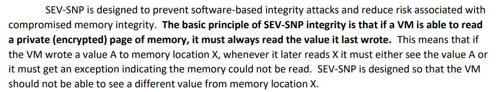
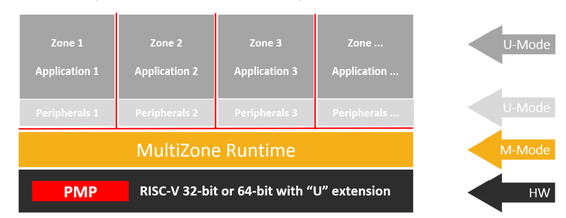
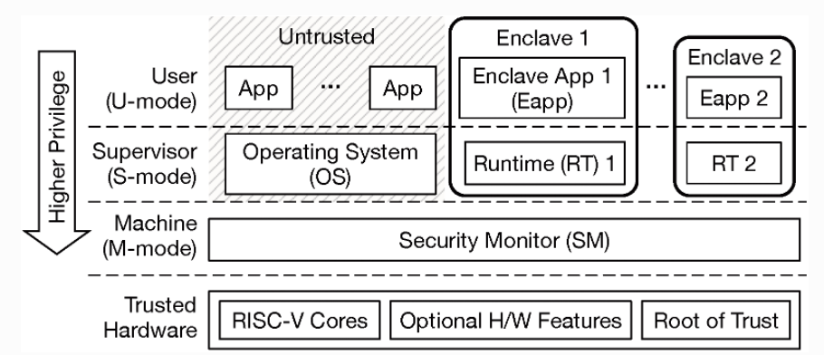

# Related work

- ARM: [Trust zone](#Trust Zone)
- AMD: SEV
- RISC-V: MultiZone

## Trust Zone

> Secure Core -> Trust OS -> Trust App

处理器架构上，TrustZone将每个物理核虚拟为两个核，一个非安全核（Non-secure Core, NS Core），运行非安全世界的代码；和另一个安全核（Secure Core），运行安全世界的代码。

两个虚拟的核以基于时间片的方式运行，根据需要实时占用物理核，并通过Monitor Mode在安全世界和非安全世界之间切换，类似同一CPU下的多应用程序环境，不同的是多应用程序环境下操作系统实现的是进程间切换，而Trustzone下的Monitor Mode实现了同一CPU上两个操作系统间的切换。

设计上，TrustZone并不是采用一刀切的方式让每个芯片厂家都使用同样的实现。总体上以AMBA3 AXI总线为基础，针对不同的应用场景设计了各种安全组件，芯片厂商根据具体的安全需求，选择不同的安全组件来构建他们的TrustZone实现。

> TrustZone设计的相关方
>
> - ARM公司: 定义TrustZone并实现硬件设计，TEE，TZAPI等
> - 芯片厂家: 在具体芯片上实现TrustZone设计，包括三星、高通、MTK、TI、ST、华为等
> - 应用提供方: 如DRM厂家和安全应用开发商，实现DRM、Playready、DTCP-IP和一些其它安全应用开发和认证

TEE环境下也要有一个操作系统，各家都有自己的Trustzone的操作系统，如Trustonic、高通的QSEE、国内的豆荚，还有开源的OPTEE等。在操作系统之上自然要有应用程序，在Trustzone里面我们一般叫TrustApp，当然TEE里面每个TrustApp都在一个沙盒里，互相之间是隔离的。比如说支付，就可以做成一个App（需要注意的是，和Normal World里面的App是两个概念），这个App简单来说就负责用私钥把网上发来的Challenge签个名，而这个签名的动作是需要在Secure World里面做的，避免恶意程序窃取到私钥来伪造签名。

> TEE本身应当是通过一定级别的认证（EAL2或EAL3，特殊行业应用EAL4及以上），而TA也肯定是需要相应机构的认证和签名才能部署到设备上去的。

### 对比SGX

Trustzone默认相信SecureOS，安全世界。SGX仅相信CPU core，通过SGX指令构建enclave容器。

TEE是个公用大保险柜，什么东西都装进去，有漏洞的app可能也进去了，而且保险柜钥匙在管理员手上，必须相信管理员。SGX每个app有自己的保险柜，钥匙在自己手上。

### 总结

ARM提供的标准中没有correctness measure， 默认相信Trustzone OS。Trustzone OS有可能被攻破，进而导致Trust App被篡改。

## AMD SEV

> [AMD Memory ENcryption white paper]([AMD_Memory_Encryption_Whitepaper_v7-Public.pdf](https://developer.amd.com/wordpress/media/2013/12/AMD_Memory_Encryption_Whitepaper_v7-Public.pdf))
>
> [AMD SEV-SNP: Strengthening VM Isolation with Integrity Protection and More](https://www.amd.com/system/files/TechDocs/SEV-SNP-strengthening-vm-isolation-with-integrity-protection-and-more.pdf)
>
> Secure Memory Encryption (SME) 是一种内存加密技术
>
> Secure Encrypted Virtualization (SEV) 是一种加密虚拟机技术

SME： SME is a real time memory encryption technology. It makes the contents of the memory more resistant to memory snooping and cold boot attacks. The encryption key is manipulated by a “Security” Processor and is invisible to OS and application. 

SEV： SEV utilizes the Secure Memory Encryption (SME) [14] technology to encrypt memory contents of a guest VM

- SEV feature allows the memory contents of virtual machine(VM) to be transparently encrypted with key unique to each VM. The hypervisor could only read the cipher-text of the contents of VM. 

SEV-SNP(Secure Nested Paging):  

- 防止Integrity attack

- VM将值A写入地址X，之后读取地址X的数据时，要么读取A，要么Exception。

SEV技术主要用于防止Hypervisor读取VM的内容。至于VM内具体运行什么，SEV并不关心。

## RISC-V MultiZone

> [multizone-sdk/manual.pdf](https://github.com/hex-five/multizone-sdk/blob/master/manual.pdf)

Decompose the traditional monolithic firmware into a few distinct functional modules called “zones”.

Each zone is compiled and linked individually, with no cross-reference to other zones, and results in its  own self-contained binary. Zones’ programs can be written in any language, built with different  toolchains, different versions of compilers and libraries, and by different developers at any point in the  hardware and software supply chain.

By  design, zones are completely separated hardware threads and don’t share any memory, so there is no  stack, hype, buffers or pointers for calling functions and passing values and/or references back and  forth.

与TrustZone类似，都基于隔离机制的安全理念。每个Zone之间相互隔离，没有任何共享内存。

> TrustZone在实现硬件安全时是将两个域硬编码到硬件中，而MultiZone则是由软件定义域，通过硬件来强化。
>
> Hex-Five 实验室在去年也将MultiZone技术应用到了Arm Cortex-M架构[Hex Five Announces MultiZone Security for Arm Cortex‑M Series Processors – Hex Five Security (hex-five.com)](https://hex-five.com/2020/02/23/hex-five-announces-multizone-security-for-arm-cortex-m/)

## RISC-V Penglai

> Penglai is a set of security solutions based on Trusted Execution Environment.
>
> [Github/Penglai-Enclave](https://github.com/Penglai-Enclave/Penglai-Enclave)

这个资料很少，上面的github repo就是几乎所有的资料了。

## RISC-V Keystone

> [2.2. Keystone Basics — Keystone Enclave 1.0.0 documentation (keystone-enclave.org)](http://docs.keystone-enclave.org/en/latest/Getting-Started/How-Keystone-Works/Keystone-Basics.html)
>
> [5. Attestation — Keystone Enclave 1.0.0 documentation (keystone-enclave.org)](http://docs.keystone-enclave.org/en/latest/Keystone-Applications/Attestation.html)

### Component

**Trusted Hardware** is a CPU package built by a trustworthy vendor, and must contain Keystone-compatible *standard RISC-V cores* and *root of trust*. The hardware may also contain optional features such as cache partitioning, memory encryption, cryptographically-secure source of randomness, etc. The Security Monitor requires platform specific plug-ins for optional feature support.

**Security Monitor (SM)** is M-mode software with small TCB. The SM provides an interface for **managing the lifecycle of enclave as well as for utilizing platform-specific features.** The SM enforces most of Keystone’s security guarantees since it manages the isolation boundary between the enclaves and the untrusted OS.

**Enclaves** are environments isolated from the untrusted OS and other enclaves. Each enclave is given a private physical memory region which is accessible by only the enclave and SM. **Each enclave consists of a user-level enclave application *eapp* and a supervisor-level *runtime*.**

**Enclave Application (eapp)** is the user-level application that executes in the enclave. One can build a custom eapp from the scratch, or just run an existing RISC-V executable in Keystone.

**Runtime** is S-mode software which implements functionality such as system calls, trap handling, virtual memory management and so on.

### Enclave life cycle

> PMP: physical memory protection

#### Creation

An enclave starts with a contiguous range of physical memory called enclave private memory (EPM). The untrusted host first allocates the EPM, and initializes it with the enclave’s page table (PT), the runtime (RT), and the eapp. **Once the host calls the SM to create an enclave the SM isolates and protects the EPM using a PMP entry.** The PMP status is propagated through all cores in the system so that the EPM is protected from any cores. **After creation, but before execution, the SM measures and verifies the initial state of the enclave.**

#### Execution

The host asks the SM to enter the enclave on one of the cores. **The SM releases the PMP permission to the core, and the core starts to execute the enclave.** The runtime can exit or re-enter the enclave any time. When a core exits/enters the enclave, it accordingly switches the PMP permissions to keep the isolation.

#### Destruction

The host may destroy the enclave at any time. On destruction, the SM clears the EPM and releases the PMP entry. The host then finally reclaims the now-free memory.

### Attestation

> [5. Attestation — Keystone Enclave 1.0.0 documentation (keystone-enclave.org)](http://docs.keystone-enclave.org/en/latest/Keystone-Applications/Attestation.html#enclave-hashes)

- SM Report contains:

  A hash of the SMThe attestation public key

- Enclave report contains:

  A hash of the enclave at initialization

  A data block from the enclave of up-to 1KB in size

和SGX较为相似。 